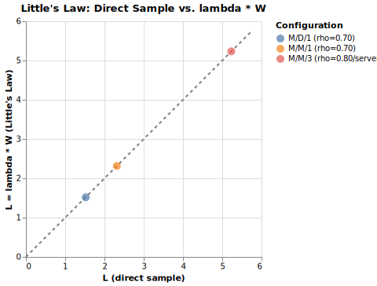

# Little's Law

Little's Law states that in a stable queueing system, L = λW, where
L is the mean number of customers in the system, λ is the mean arrival
rate, and W is the mean time each customer spends in the system.
The law holds regardless of arrival or service distributions, number of
servers, or scheduling discipline.

The simulation verifies the law across three configurations:

-   M/M/1 (Poisson arrivals, exponential service, one server)
-   M/D/1 (Poisson arrivals, deterministic service, one server)
-   M/M/3 (Poisson arrivals, exponential service, three servers)

For each configuration, L is measured two ways: by direct sampling of the
queue length, and by computing λW from observed throughput and mean
sojourn time.

## Source and Output

```python
--8<-- "examples/13_littles.py"
```

--8<-- "output/13_littles.txt"

## Chart



Each point is one configuration. The dashed diagonal is the line L_direct =
L_little; points on the diagonal mean the two estimates agree exactly.

## Key Points

1.  `Monitor` samples `in_system[0]` every `SAMPLE_INTERVAL` time units to
    estimate L directly without any queueing formula.

2.  The `error_%` column shows that L_direct and λW agree to within
    less than 1% for all three configurations, even though the service-time
    distributions are completely different.

3.  `DeterministicCustomer` uses a fixed `DETERMINISTIC_SERVICE` constant
    rather than a random draw; everything else in the simulation is unchanged.
    The law still holds.

4.  `Resource(env, capacity=3)` creates a three-slot server for M/M/3.
    The arrival rate is set to 2.4 so that utilization per server is 0.8.

## Check for Understanding

`run_scenario` computes `lam_obs = len(sojourns) / SIM_TIME` rather than using
the nominal arrival rate passed to `RandomArrivals`.
Why is the observed throughput the right value to use in Little's Law, and when
would the two differ significantly?
