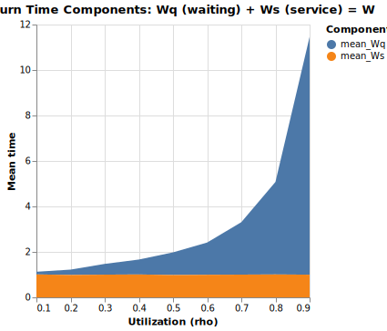

# Sojourn Time

The sojourn time W is the total time a customer spends in the system from
arrival to departure.  It has two components: Wq, the time spent waiting
for the server to become free, and Ws, the time spent in service.

For an M/M/1 queue with service rate μ, the mean sojourn time is
W = 1 / (μ (1 - ρ)), where ρ is the utilization.  The mean service
time Ws = 1/μ stays constant as load increases; all the extra delay at
high utilization comes from Wq growing without bound as ρ approaches 1.

The simulation runs a single M/M/1 queue at nine utilization levels from
ρ = 0.1 to ρ = 0.9 and reports both components alongside the
theoretical W and two independent estimates of L.

## Source and Output

```python
--8<-- "examples/14_sojourn.py"
```

--8<-- "output/14_sojourn.txt"

## Chart



The stacked area shows how the waiting component Wq grows steeply at high
utilization while the service component Ws remains roughly constant.

## Key Points

1.  `Customer` records `service_start = self.now` inside the `async with
    self.server:` block.  That line executes only after the resource is
    acquired, so `service_start - arrival` is the pure waiting time Wq.

2.  `mean_Ws = mean_W - mean_Wq` is derived rather than measured directly;
    it equals the mean of the individual service times.

3.  `theory_W = 1.0 / (SERVICE_RATE * (1.0 - rho))` gives the M/M/1
    formula.  The simulated `mean_W` tracks it closely at low utilization
    and diverges slightly at ρ = 0.9, where variance is high and
    20 000 time units is a shorter run relative to the long tails.

4.  `L_sampled` and `L_little` should agree by Little's Law; the table
    confirms they do across all utilization levels.

## Check for Understanding

At ρ = 0.9, `mean_W` is noticeably higher than `theory_W`.
What property of the exponential distribution causes the simulated mean
to be a noisy estimate at high utilization, and how would increasing
`SIM_TIME` change the gap?
